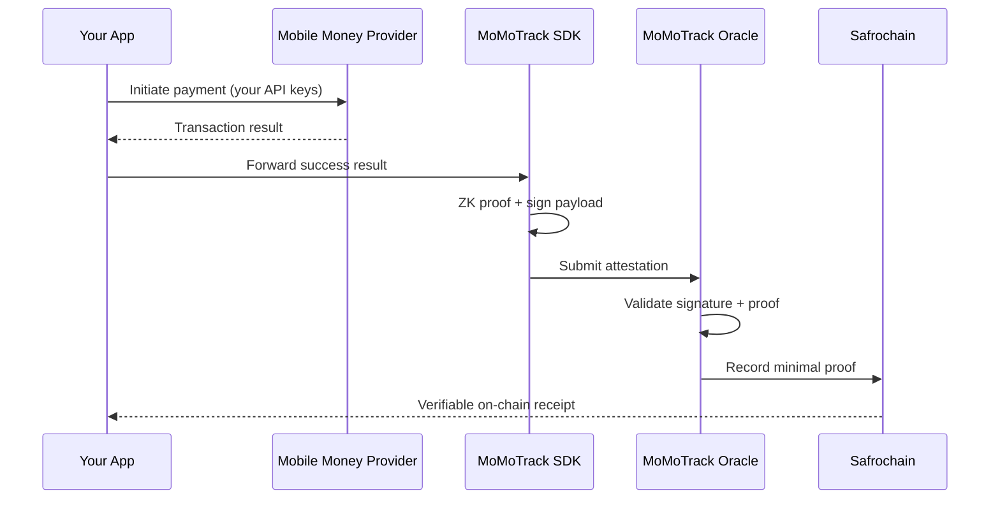

<p align="center">
  <strong>MoMoTrack Oracle</strong><br>
  On-chain Mobile Money verification for Africa
</p>

<p align="center">
  <a href="https://github.com/Safrochain-Org/MoMoTrack-Oracle/blob/main/LICENSE">
    
  </a>
  <a href="https://github.com/Safrochain-Org/MoMoTrack-Oracle/actions">
    
  </a>
  <a href="https://safrochain.com">
    
  </a>
</p>

---

MoMoTrack is a lightweight, open-source oracle that brings Mobile Money (MoMo) transactions on-chain. It is a **verification and provenance layer** on top of licensed aggregators (PowerPay, Cotanipay, and others), not a financial intermediary. P2P apps, remittance platforms, tontines, and DeFi protocols get immutable payment proofs on [Safrochain](https://safrochain.com) without screenshots, disputes, or manual reconciliation.

> **Read the full explanation:** [docs/HOW_IT_WORKS.md](./docs/HOW_IT_WORKS.md)

## Why MoMoTrack

| Problem | MoMoTrack solution |
| --- | --- |
| "I sent but it didn't arrive" disputes | Cryptographic on-chain proof anyone can verify |
| Screenshot-based proof of payment | Immutable attestation with amount, time, and reference |
| Phone numbers exposed to third parties | Zero-knowledge proofs generated on the client device |
| Manual back-office reconciliation | Automatic recording after each successful payment |
| Fragmented Mobile Money APIs | One SDK layer across major African aggregators |

## How it works

```text
Developer's Application
        │
        ▼
MoMoTrack SDK (client-side)     ← ZK-proof + signed payload
        │
        ▼
MoMoTrack Oracle (off-chain)    ← validation + relay
        │
        ▼
Safrochain (on-chain)           ← immutable record + events
```



1. **Integrate your aggregator**: PowerPay, Cotanipay, or another provider with your own API keys and compliance.
2. **Add the MoMoTrack SDK**: Lightweight client for mobile or web.
3. **Attest on success**: SDK masks sensitive data with ZK, oracle validates, Safrochain stores the proof.
4. **Verify anywhere**: Query or subscribe to on-chain events; no manual proof steps for recipients.

| Document | Contents |
| --- | --- |
| [HOW_IT_WORKS.md](./docs/HOW_IT_WORKS.md) | Full 6-step flow, components, benefits |
| [ARCHITECTURE.md](./docs/ARCHITECTURE.md) | Layers, deployment, extensibility |
| [DATA_SCHEMA.md](./docs/DATA_SCHEMA.md) | Payload and on-chain record formats |
| [SECURITY_MODEL.md](./docs/SECURITY_MODEL.md) | Threat model and privacy guarantees |
| [ROADMAP.md](./docs/ROADMAP.md) | Implementation phases |

## Features

- **Verification, not custody**: MoMoTrack never touches funds
- **Aggregator support**: PowerPay, Cotanipay, and extensible provider adapters
- **Privacy-first**: Client-side ZK; phone numbers never leave the device in plaintext
- **On-chain receipts**: Transaction reference, amount, timestamp, and anonymized parties
- **Opt-in**: Only SDK-routed successful transactions are recorded
- **Multi-platform SDK**: TypeScript, React Native, and Flutter (roadmap)
- **Open source**: MIT licensed, auditable, community-driven

## Quick start

> SDK packages are being published. Follow this repo for release announcements.

### Install (Node.js / TypeScript)

```bash
npm install @safrochain/momotrack
```

### Basic usage

```typescript
import { MoMoTrack } from "@safrochain/momotrack";

const momotrack = new MoMoTrack({
  network: "safrochain-testnet",
  provider: "powerpay",
});

await momotrack.attest({
  transactionId: "txn_abc123",
  amount: 5000,
  currency: "CDF",
  status: "success",
});
```

See [docs/GETTING_STARTED.md](./docs/GETTING_STARTED.md) for environment setup, provider configuration, and testnet deployment.

## Repository layout

```text
MoMoTrack-Oracle/
├── docs/
│   ├── HOW_IT_WORKS.md    # End-to-end flow (start here)
│   ├── ARCHITECTURE.md    # Technical components
│   ├── DATA_SCHEMA.md     # Payload schemas
│   ├── SECURITY_MODEL.md  # Threat model
│   └── ROADMAP.md         # Implementation plan
├── .github/               # Issue/PR templates and CI
├── LICENSE                # MIT
├── CONTRIBUTING.md
├── SECURITY.md
└── CHANGELOG.md
```

## Supported providers

| Provider | Status | Region |
| --- | --- | --- |
| PowerPay | Planned | DRC |
| Cotanipay | Planned | Central Africa |
| Custom adapter | [Open an issue](https://github.com/Safrochain-Org/MoMoTrack-Oracle/issues/new?template=provider_request.yml) | - |

Want your aggregator listed? Use the [provider request template](.github/ISSUE_TEMPLATE/provider_request.yml).

## Development

```bash
git clone https://github.com/Safrochain-Org/MoMoTrack-Oracle.git
cd MoMoTrack-Oracle
nvm use
npm install
npm run verify    # lint, typecheck, and tests
```

Read [CONTRIBUTING.md](./CONTRIBUTING.md) before opening a pull request.

## Security

Report vulnerabilities privately. Do **not** open a public GitHub issue for security findings.

See [SECURITY.md](./SECURITY.md) for our disclosure policy and contact details.

## Community

| Channel | Link |
| --- | --- |
| Documentation | [docs.safrochain.com](https://docs.safrochain.com) |
| Discord | [discord.gg/safrochain](https://discord.gg/safrochain) |
| GitHub Issues | [Report bugs & request features](https://github.com/Safrochain-Org/MoMoTrack-Oracle/issues) |
| X (Twitter) | [@safrochain](https://x.com/safrochain) |

## License

This project is licensed under the [MIT License](./LICENSE).

Copyright (c) 2026 [Safrochain](https://safrochain.com).
