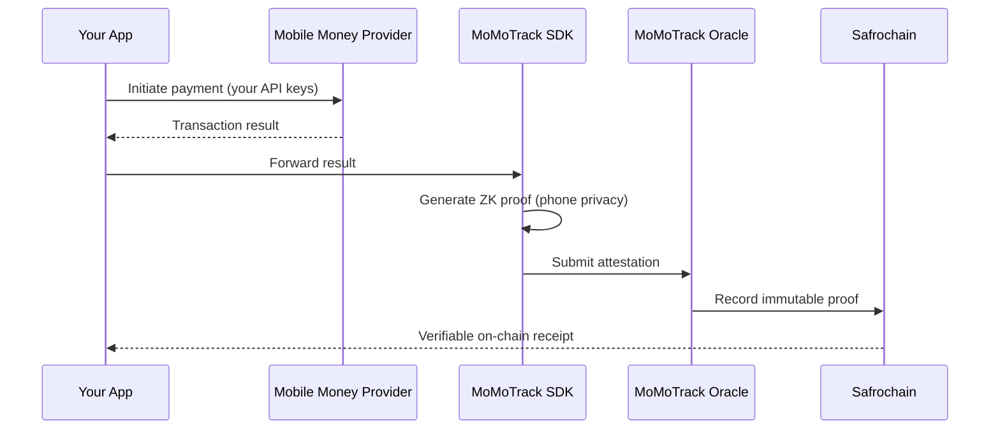

<p align="center">
  <strong>MoMoTrack Oracle</strong><br>
  On-chain Mobile Money verification for Africa
</p>

<p align="center">
  <a href="https://github.com/Safrochain-Org/MoMoTrack-Oracle/blob/main/LICENSE">
    
  </a>
  <a href="https://github.com/Safrochain-Org/MoMoTrack-Oracle/actions">
    
  </a>
  <a href="https://safrochain.com">
    
  </a>
</p>

---

MoMoTrack is an open-source oracle that turns Mobile Money payments into immutable, on-chain proofs on [Safrochain](https://safrochain.com). P2P apps, remittance platforms, tontines, and DeFi protocols can verify payments without screenshots, manual reconciliation, or trust-based disputes.

## Why MoMoTrack

| Problem | MoMoTrack solution |
| --- | --- |
| Payment disputes rely on screenshots | Cryptographic proof recorded on-chain |
| Phone numbers exposed to third parties | Zero-knowledge proofs generated on the client device |
| Manual back-office reconciliation | Automatic status, amount, and timestamp attestation |
| Fragmented Mobile Money APIs | Unified SDK across major African aggregators |

## How it works



1. **Integrate your provider** — Connect to PowerPay, Cotanipay, or another aggregator using your own credentials.
2. **Add the MoMoTrack SDK** — Drop the lightweight client into your mobile or web app.
3. **Capture and attest** — On success, the SDK applies a ZK proof, forwards the attestation to the oracle, and records the proof on Safrochain.

## Features

- **Aggregator support** — PowerPay, Cotanipay, and extensible provider adapters
- **Privacy-first** — ZK proofs on the client; phone numbers never leave the device in plaintext
- **On-chain receipts** — Transaction status, amount, and timestamp written to Safrochain
- **Multi-platform SDK** — TypeScript/JavaScript, React Native, and Flutter (roadmap)
- **Open source** — MIT licensed, community-driven, free to use

## Quick start

> SDK packages are being published. Follow this repo for release announcements.

### Install (Node.js / TypeScript)

```bash
npm install @safrochain/momotrack
```

### Basic usage

```typescript
import { MoMoTrack } from "@safrochain/momotrack";

const momotrack = new MoMoTrack({
  network: "safrochain-testnet",
  provider: "powerpay",
});

await momotrack.attest({
  transactionId: "txn_abc123",
  amount: 5000,
  currency: "CDF",
  status: "success",
});
```

See [docs/GETTING_STARTED.md](./docs/GETTING_STARTED.md) for environment setup, provider configuration, and testnet deployment.

## Repository layout

```text
MoMoTrack-Oracle/
├── docs/                  # Guides and architecture
├── .github/               # Issue/PR templates and CI workflows
├── LICENSE                # MIT
├── CONTRIBUTING.md        # Contribution guide
├── SECURITY.md            # Vulnerability reporting
└── CHANGELOG.md           # Release history
```

## Supported providers

| Provider | Status | Region |
| --- | --- | --- |
| PowerPay | Planned | DRC |
| Cotanipay | Planned | Central Africa |
| Custom adapter | [Open an issue](https://github.com/Safrochain-Org/MoMoTrack-Oracle/issues/new?template=provider_request.yml) | — |

Want your aggregator listed? Use the [provider request template](.github/ISSUE_TEMPLATE/provider_request.yml).

## Development

```bash
git clone https://github.com/Safrochain-Org/MoMoTrack-Oracle.git
cd MoMoTrack-Oracle
nvm use
npm install
npm run verify    # lint, typecheck, and tests
```

Read [CONTRIBUTING.md](./CONTRIBUTING.md) before opening a pull request.

## Security

Report vulnerabilities privately. Do **not** open a public GitHub issue for security findings.

See [SECURITY.md](./SECURITY.md) for our disclosure policy and contact details.

## Community

| Channel | Link |
| --- | --- |
| Documentation | [docs.safrochain.com](https://docs.safrochain.com) |
| Discord | [discord.gg/safrochain](https://discord.gg/safrochain) |
| GitHub Issues | [Report bugs & request features](https://github.com/Safrochain-Org/MoMoTrack-Oracle/issues) |
| X (Twitter) | [@safrochain](https://x.com/safrochain) |

## License

This project is licensed under the [MIT License](./LICENSE).

Copyright (c) 2026 [Safrochain](https://safrochain.com).
