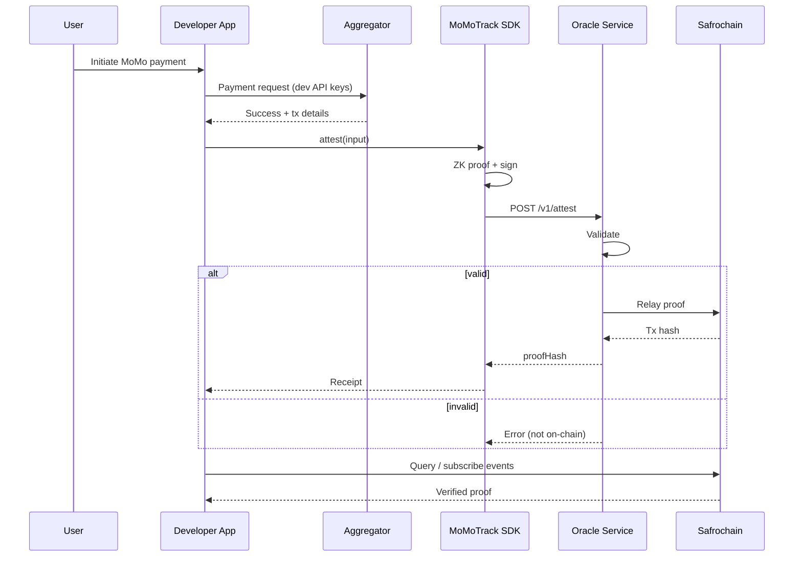

# Architecture

Technical architecture of MoMoTrack: a verification and provenance layer for Mobile Money payments on Safrochain. For the full narrative walkthrough, see [HOW_IT_WORKS.md](./HOW_IT_WORKS.md).

## Design goals

| Goal | Approach |
| --- | --- |
| Not a financial intermediary | No fund custody; attestations only |
| Minimal on-chain footprint | Small contract / module; low fees |
| Privacy for MSISDNs | Client-side ZK proofs and commitments |
| Developer autonomy | Bring your own aggregator keys and compliance |
| High availability | Horizontally scaled oracle nodes |

## System layers

```text
┌─────────────────────────────────────────────────────────────┐
│  Layer 1: Developer's application                         │
│  UI · backend · aggregator integration (PowerPay, etc.)     │
└────────────────────────────┬────────────────────────────────┘
                             │
┌────────────────────────────▼────────────────────────────────┐
│  Layer 2: MoMoTrack SDK (client-side)                       │
│  Intercept success · ZK proof · sign · submit               │
└────────────────────────────┬────────────────────────────────┘
                             │
┌────────────────────────────▼────────────────────────────────┐
│  Layer 3: MoMoTrack Oracle (off-chain)                      │
│  Validate · dedupe · optional cache check · relay           │
└────────────────────────────┬────────────────────────────────┘
                             │
┌────────────────────────────▼────────────────────────────────┐
│  Layer 4: Safrochain (on-chain)                             │
│  Proof storage · events · public verification               │
└─────────────────────────────────────────────────────────────┘
```

## Components

### MoMoTrack SDK

Lightweight client library (TypeScript, React Native, Flutter).

| Responsibility | Details |
| --- | --- |
| Intercept success | Called by app after aggregator confirms payment |
| ZK proof | Generated on device; masks phone numbers |
| Payload packaging | Amount, timestamp, tx ref, status, proof |
| Signing | User wallet or app-configured key |
| Submission | HTTPS to oracle `/v1/attest` |

The SDK **never** holds aggregator API keys.

**Platforms:** `@safrochain/momotrack` (npm), React Native, Flutter (roadmap).

### Developer's backend

Your existing payment infrastructure.

| Responsibility | Details |
| --- | --- |
| Aggregator API | Initiate and confirm MoMo transactions |
| Webhooks | Verify provider callback signatures |
| Business logic | Orders, escrow, when to trigger SDK |
| Compliance | KYC and licensing with the aggregator |

MoMoTrack does not replace this layer.

### MoMoTrack Oracle

Off-chain service in this repository. Node.js or Go; multiple redundant nodes.

| Responsibility | Details |
| --- | --- |
| Ingress | TLS-terminated attestation API |
| Validation | Signature, ZK proof, sanity checks |
| Deduplication | Reject replayed transaction references |
| Cache check | Optional cross-check with aggregator cache |
| Relay | Submit minimal record to Safrochain |
| Observability | Health endpoints, metrics, alerts |

Failed validations are logged but **not** written on-chain.

### Safrochain smart contract / module

Minimal on-chain component (Cosmos SDK module or CosmWasm).

| Stored | Emitted |
| --- | --- |
| Transaction reference | `momotrack/proof_recorded` event |
| Amount, currency, timestamp | Indexer-friendly attributes |
| ZK commitments (anonymized parties) | - |
| Oracle signature | - |

Designed for low gas and small audit surface. Implementation in Rust targeting Cosmos SDK.

### Zero-knowledge layer

Executed **only** on the client device.

| Phase | Technology |
| --- | --- |
| Alpha | Pedersen commitments + digest binding |
| Production | zk-SNARKs (circuit TBD, audited pre-GA) |

Libraries may include circom, arkworks, or equivalent. See [SECURITY_MODEL.md](./SECURITY_MODEL.md).

### Monitoring

Operational dashboard for:

- Oracle node health and relay latency
- Aggregator API error rates (operator-configured)
- On-chain relay failures
- Alerting for sustained validation errors

## Request lifecycle



## Data boundaries

See [DATA_SCHEMA.md](./DATA_SCHEMA.md) for full field definitions.

| Data | Client | Oracle | Chain |
| --- | --- | --- | --- |
| Raw MSISDN | Local only | Never | Never |
| Amount, currency, tx ref | Yes | Yes | Yes |
| ZK proof + commitments | Yes | Verify only | Commitments |
| App metadata | Optional | Redacted | Hash or omit |

## Trust model

| Actor | Role |
| --- | --- |
| End user | Trusts their device for ZK and signing |
| Developer | Trusts their aggregator integration and backend |
| MoMoTrack oracle | Trusted for validation integrity and relay |
| Safrochain | Trusted for immutability and consensus |

MoMoTrack does **not** custody funds. Full threat analysis: [SECURITY_MODEL.md](./SECURITY_MODEL.md).

## Extensibility

### Provider adapters (oracle-side, optional)

```text
ProviderAdapter
├── providerId() → string
├── validateWebhook(payload, signature) → boolean
├── normalizeTransaction(raw) → AttestationInput
└── fetchTransactionStatus(id) → Status   // optional cache check
```

New aggregators: [provider request template](../.github/ISSUE_TEMPLATE/provider_request.yml).

### Networks

Configured per deployment:

- `safrochain-testnet`
- `safrochain-mainnet`

Contract addresses documented in `NETWORKS.md` (Phase 3).

## Deployment topology

```text
                    ┌─────────────┐
                    │  SDK clients │
                    │  (global)    │
                    └──────┬──────┘
                           │ HTTPS
              ┌────────────┼────────────┐
              ▼            ▼            ▼
        ┌──────────┐ ┌──────────┐ ┌──────────┐
        │ Oracle   │ │ Oracle   │ │ Oracle   │
        │ node 1   │ │ node 2   │ │ node N   │
        └────┬─────┘ └────┬─────┘ └────┬─────┘
             └────────────┼────────────┘
                          │ RPC
                    ┌─────▼─────┐
                    │ Safrochain │
                    └───────────┘
```

Oracle nodes are stateless validators + relay workers behind a load balancer. Shared deduplication store (e.g. Redis) prevents replay across nodes.

## Related repositories

| Repository | Role |
| --- | --- |
| [safrochain-node](https://github.com/Safrochain-Org/safrochain-node) | Layer 1 chain and on-chain modules |
| [MoMoTrack-Oracle](https://github.com/Safrochain-Org/MoMoTrack-Oracle) | SDK + oracle (this repo) |

## See also

- [HOW_IT_WORKS.md](./HOW_IT_WORKS.md): Step-by-step flow and benefits
- [DATA_SCHEMA.md](./DATA_SCHEMA.md): Payload schemas
- [ROADMAP.md](./ROADMAP.md): Implementation timeline
