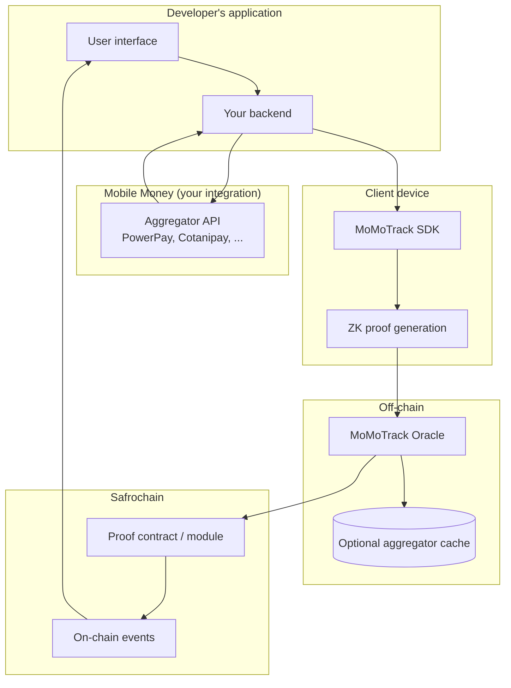

# How MoMoTrack works

MoMoTrack is a lightweight, open-source oracle that brings Mobile Money (MoMo) transactions on-chain. It acts as a **verification and provenance layer** on top of existing licensed Mobile Money aggregators (PowerPay, Cotanipay, and others), without becoming a financial intermediary.

Its core purpose is to eliminate manual proof-of-payment problems (screenshots, disputes, "I sent but it didn't arrive") by making successful transactions verifiable, transparent, and immutable on [Safrochain](https://safrochain.com).

## Overview

| Principle | Description |
| --- | --- |
| **Not a payment processor** | MoMoTrack never holds or routes funds |
| **Verification only** | Records proof that a MoMo payment succeeded |
| **Developer-owned integration** | You keep your aggregator API keys and compliance relationship |
| **Privacy by design** | Sensitive identifiers are masked client-side via zero-knowledge proofs |
| **Opt-in** | Only transactions explicitly routed through the SDK are recorded on-chain |

## High-level architecture

```text
Developer's Application
        │
        ▼
MoMoTrack SDK (Client-side)
        │  ZK-proof + signed payload
        ▼
MoMoTrack Oracle Service (Off-chain)
        │  Validation + relay
        ▼
Safrochain Smart Contract (On-chain)
        │
        ▼
Immutable Record + Events
```



## Step-by-step flow

### Step 1: Developer integration (one-time setup)

The developer integrates their chosen Mobile Money aggregator **themselves** using their own API keys.

| Responsibility | Owner |
| --- | --- |
| Aggregator API keys | Developer |
| KYC, licensing, compliance | Developer ↔ provider |
| Payment initiation and webhooks | Developer's backend |
| MoMoTrack SDK installation | Developer |

MoMoTrack does not replace your aggregator integration. It adds an attestation layer on top of it.

### Step 2: Transaction initiation

1. User A sends money via Mobile Money inside the app (standard flow through the aggregator).
2. The aggregator processes the transaction.
3. The result (success/failure, amount, transaction ID, timestamp) returns to the developer's application via callback or polling.

```text
User → App → Aggregator → App (transaction result)
```

Failed transactions are handled by your app as usual. MoMoTrack only attests **successful** payments unless you explicitly configure otherwise.

### Step 3: Client-side processing (SDK)

When a transaction succeeds, the MoMoTrack SDK intercepts the result on the **user's device**.

On the client, the SDK:

1. Applies a **zero-knowledge proof** to mask sensitive data (e.g. full phone numbers) while preserving proof of the `from → to` relationship for involved parties.
2. Packages the attestation: amount, timestamp, transaction reference, status, ZK proof.
3. Signs the payload with the user's wallet or application key.
4. Sends the secure payload to MoMoTrack oracle endpoints.

```text
Transaction result
    → ZK proof (device-local)
    → Signed attestation payload
    → POST /v1/attest
```

> **Privacy:** Raw phone numbers and MSISDNs never leave the device in plaintext. See [SECURITY_MODEL.md](./SECURITY_MODEL.md).

### Step 4: Oracle layer (off-chain)

The oracle receives the payload and performs validation:

| Check | Action on failure |
| --- | --- |
| Signature verification | Reject with `401` / `invalid_signature` |
| ZK proof validation | Reject with `422` / `invalid_proof` |
| Sanity checks (amount, timestamp, status) | Reject with `400` / `invalid_payload` |
| Deduplication (replay of tx reference) | Reject with `409` / `duplicate_attestation` |
| Optional aggregator cross-check | Reject or flag if cache mismatch |

If valid, the oracle forwards a **minimal, clean transaction record** to the Safrochain smart contract.

Errors and failed MoMo transactions are logged for operations but are **not** pushed on-chain.

### Step 5: On-chain recording

A minimal smart contract on Safrochain receives the attestation and:

- Stores an immutable proof record
- Emits an event for real-time listeners

| Field | Stored on-chain |
| --- | --- |
| Transaction reference | Yes (aggregator tx ID or hash) |
| Amount | Yes |
| Timestamp | Yes |
| Sender / receiver identifiers | Anonymized via ZK commitments |
| Oracle signature / proof | Yes |
| Raw phone numbers | **Never** |

This creates a publicly verifiable record without exposing PII.

### Step 6: Verification and consumption

Any application or user can verify the payment instantly:

- **Query** the on-chain record by proof hash or transaction reference
- **Subscribe** to contract events for real-time settlement
- **Display** confirmed proof in wallet or app UI without manual screenshots

```text
Recipient app → query Safrochain → proof confirmed → release goods / update balance
```

## Key technical components

| Component | Role | Implementation |
| --- | --- | --- |
| **SDK** | Client library for attestation | TypeScript, React Native, Flutter |
| **Oracle backend** | Ingestion, validation, relay | Node.js or Go; horizontally scaled |
| **Smart contract** | Minimal on-chain storage + events | Cosmos SDK module / CosmWasm |
| **ZK layer** | Client-side privacy | zk-SNARKs or commitment scheme (TBD) |
| **Monitoring** | Aggregator and oracle health | Dashboard + alerts |

See [ARCHITECTURE.md](./ARCHITECTURE.md) for component boundaries and [DATA_SCHEMA.md](./DATA_SCHEMA.md) for payload formats.

## Security and trust model

| Property | Guarantee |
| --- | --- |
| No custody of funds | MoMoTrack never touches money |
| Client-side ZK | Sensitive data never leaves the device in clear form |
| Signature + proof | Every on-chain record is cryptographically verifiable |
| Open source | Transparent, auditable codebase (MIT) |
| Opt-in | Only SDK-routed successful transactions are recorded |

Full threat model: [SECURITY_MODEL.md](./SECURITY_MODEL.md).

## Benefits for developers

- **One extra SDK import** alongside your existing aggregator integration
- **Automatic on-chain proof** after each successful payment
- **Reduced support load**: fewer screenshot disputes
- **New use cases**: trustless P2P, conditional tontines, DeFi collateral, escrow
- **No vendor lock-in**: works with your chosen aggregator and your compliance stack

## What MoMoTrack is not

| MoMoTrack is | MoMoTrack is not |
| --- | --- |
| A verification oracle | A Mobile Money aggregator |
| An attestation layer | A KYC or licensing provider |
| Open-source infrastructure | A custodian of user funds |
| Optional per transaction | A replacement for your payment API |

## Related documentation

| Document | Contents |
| --- | --- |
| [ARCHITECTURE.md](./ARCHITECTURE.md) | Components, trust boundaries, extensibility |
| [DATA_SCHEMA.md](./DATA_SCHEMA.md) | Attestation payload and on-chain record schema |
| [SECURITY_MODEL.md](./SECURITY_MODEL.md) | Threat model, privacy, operational security |
| [GETTING_STARTED.md](./GETTING_STARTED.md) | Integration quick start |
| [ROADMAP.md](./ROADMAP.md) | Implementation phases and milestones |
